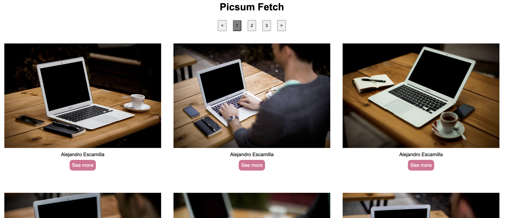
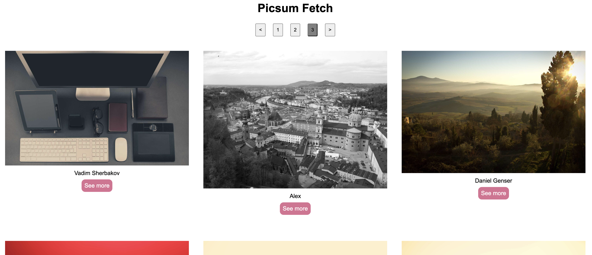

# Project API

A gallery created entirely through JS fetch function using an API from picsum.
I created the possibility to browse through 3 pages of images through navigation buttons on the top.

Used methods:
- fetch
- EventListeners
- API Array with objects
- createElement and append

## Autors

This project was a task done by me for training purposes

## Tools Used

- HTML
- SCSS
- JavaScript

## Try it out:

https://karakayametin8787.github.io/Project_API/
## Screenshots

Screenshot 1:

Screenshot 2:

## Flowchart

no flowchart created for this project
